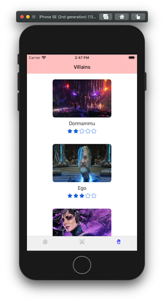

# 03 Persistencia, Instrumentación y Optimización

Aplicación básica iOS sobre _Los Vengadores_ en el que se efectúan combates de forma aleatoria.

## Tecnologías

- Xcode
- Swift

-- Persistencia: **CoreData** y **UserDefaults**

## Especificaciones

- Definir e implementar una base de datos utilizando **CoreData**.
- Creación de datos por defecto cuando se carga la aplicación por primera vez.
- Crear batallas y en base a su poder y de forma aleatoria se elegirá al vencedor.
- Almacenar la última pantalla visitada por el usuario mediante **UserDefaults**.
- Se podrán eliminar batallas ya finalizadas actualizando todos los datos necesarios para asegurar la consistencia de la base de datos.

##### Capturas de pantallas

